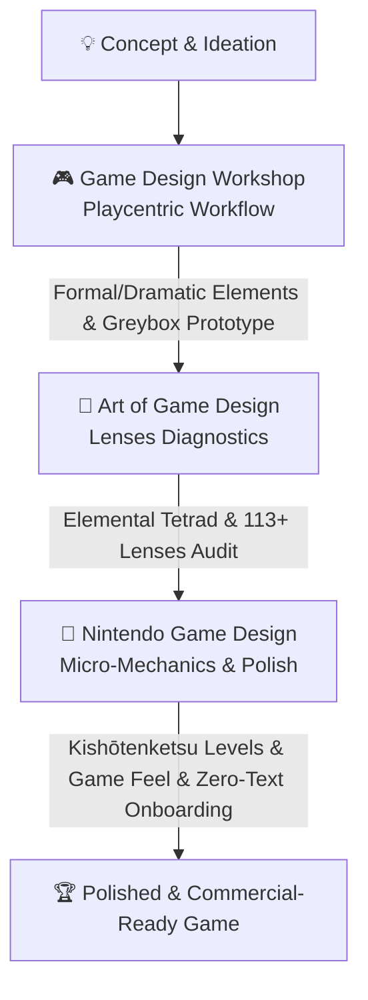

# Game Design Skills Suite 🎮✨

> A unified suite of AI Agent mentor skills based on world-class game design literature and Nintendo's legendary design methodologies. Built for indie developers, game systems/level designers, and creative teams.

[](LICENSE)
[](#-the-3-integrated-skills)
[](https://github.com/Wilson520403/game-design-skills/pulls)

English | [简体中文](README_CN.md)

---

## 🌟 Why This Suite?

Game design merges **artistic intuition** with **rigorous engineering**. This suite transforms three foundational game design pillars into actionable, structured AI capabilities:



---

## 📦 The 3 Integrated Skills

| Skill Directory | Foundational Literature | Core Capabilities & Problems Solved | Best Phase |
| :--- | :--- | :--- | :--- |
| [**/game-design-workshop**](./game-design-workshop) | Tracy Fullerton, *Game Design Workshop* | 0-to-1 Player Experience Goals, 8 Formal / 4 Dramatic Elements, Prototyping, 5-stage blind playtest protocols, and GDD authoring. | **Ideation & Early Prototyping** |
| [**/art-of-game-design**](./art-of-game-design) | Jesse Schell, *The Art of Game Design: A Book of Lenses* | Elemental Tetrad balance (Mechanics/Story/Aesthetics/Tech), 113+ Lenses targeted audit, 12 dimensions of game balance, and indirect control psychology. | **Mid-Stage Diagnostics & Balance** |
| [**/nintendo-game-design**](./nintendo-game-design) | Miyamoto, Yokoi, Sakurai, Fujibayashi Nintendo Philosophy | *Lateral Thinking with Withered Technology*, Multi-Solution Rule, Kishōtenketsu 4-step levels, Triangle Rule Hakoniwa exploration, Game Feel, and Invisible Tutorials. | **Level Design, Game Feel & Polish** |

---

## ⚡ Installation

### Option 1: AI Prompt Installation (Recommended)

Paste this prompt into your AI Agent (Claude Code, Gemini CLI, Cursor, etc.):

```text
Please clone https://github.com/Wilson520403/game-design-skills.git and install all three skill directories (game-design-workshop, art-of-game-design, nintendo-game-design) into my global skills directory.
```

### Option 2: Command-Line Installation

```bash
# 1. Clone into a temporary folder
git clone https://github.com/Wilson520403/game-design-skills.git temp-skills

# 2. Copy the 3 skills into your global skills directory
mkdir -p ~/.config/skills
cp -r temp-skills/game-design-workshop ~/.config/skills/
cp -r temp-skills/art-of-game-design ~/.config/skills/
cp -r temp-skills/nintendo-game-design ~/.config/skills/

# 3. Clean up
rm -rf temp-skills
```

### Option 3: Install Specific Skills Independently

- **Only Game Design Workshop**: Copy `game-design-workshop/`
- **Only Art of Game Design**: Copy `art-of-game-design/`
- **Only Nintendo Game Design**: Copy `nintendo-game-design/`

---

## 🎯 Synergy & Practical Examples

Prompt your AI naturally to combine the strengths of all three frameworks:

### Example 1: 0-to-1 Core Mechanic Ideation
> *"I'm designing a sign-language rhythm exploration game. First, use **Game Design Workshop** to define the core experience goals and formal elements. Then use **Nintendo Game Design**'s Lateral Thinking and Multi-Solution Rule to make a single gesture handle movement, combat, and puzzle interaction."*

### Example 2: Dominant Strategy / Boring Combat Audit
> *"Playtesters are spamming a single combo. Use **The Art of Game Design**'s Lens of Dominant Strategy and Lens of Skill vs. Chance to diagnose the root cause, then use **Nintendo Game Design**'s Risk & Reward framework to propose 3 mechanic fixes."*

### Example 3: Intuitive Level & Onboarding Design
> *"We are building a water temple puzzle level. Use **Koichi Hayashida's Kishōtenketsu 4-step structure** to pace the introduction and twist, and design zero-text onboarding inspired by **Super Mario 1-1 Invisible Tutorials**."*

---

## 📂 Repository Architecture

```
game-design-skills/
├── README.md                                 # Top-level English documentation
├── README_CN.md                              # Top-level Chinese documentation
├── LICENSE                                   # MIT License
│
├── game-design-workshop/                     # Skill 1: Game Design Workshop
│   ├── SKILL.md                              # Skill Prompt & Dual Workflows
│   ├── README.md                             # English README
│   ├── README_CN.md                          # Chinese README
│   ├── LICENSE                               # MIT License
│   └── references/                           # 5 Knowledge references
│
├── art-of-game-design/                       # Skill 2: The Art of Game Design
│   ├── SKILL.md                              # Skill Prompt & Tri-Mode Workflows
│   ├── README.md                             # English README
│   ├── README_CN.md                          # Chinese README
│   ├── LICENSE                               # MIT License
│   └── references/                           # 5 Knowledge references
│
└── nintendo-game-design/                     # Skill 3: Nintendo Game Design
    ├── SKILL.md                              # Skill Prompt & Tri-Mode Workflows
    ├── README.md                             # English README
    ├── README_CN.md                          # Chinese README
    ├── LICENSE                               # MIT License
    └── references/                           # 6 Knowledge references
```

---

## 📜 References & Acknowledgments

- **Tracy Fullerton**, *Game Design Workshop: A Playcentric Approach to Creating Innovative Games* (4th Edition), CRC Press.
- **Jesse Schell**, *The Art of Game Design: A Book of Lenses* (3rd Edition), CRC Press.
- **Shigeru Miyamoto, Gunpei Yokoi, Satoru Iwata, Masahiro Sakurai, Hidemaro Fujibayashi, Koichi Hayashida** — *Nintendo Game Design Philosophy & GDC Lectures*.

---

## 📄 License

This project is licensed under the [MIT License](LICENSE). PRs, feedback, and additions are warmly welcomed!
