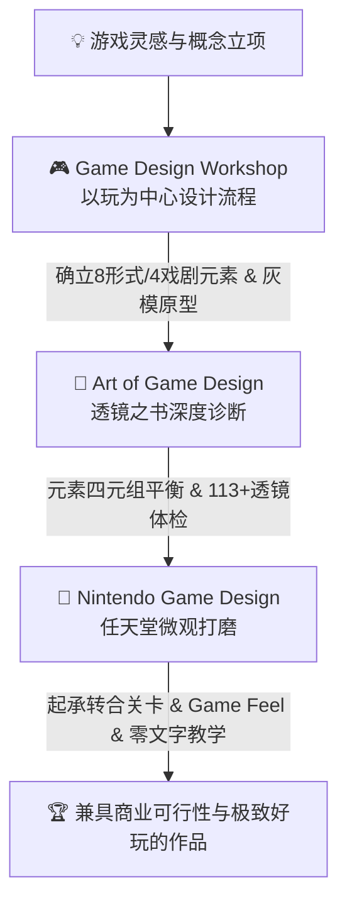

# 游戏设计 AI 技能全家桶 (Game Design Skills Suite) 🎮✨

> 基于世界顶级游戏设计经典与任天堂等大师方法论封装的 AI Agent 导师套件。为独立游戏开发者、系统/数值/关卡策划与创意团队打造的全流程设计伴侣。

[](LICENSE)
[](#-套件包含的-3-大-skills)
[](https://github.com/Wilson520403/game-design-skills/pulls)

[English](README.md) | 简体中文

---

## 🌟 为什么需要这个套件？

游戏设计兼具**艺术直觉**与**严谨工程**。本套件将三大经典理论与工业界顶级实践进行系统化封装，转化为 AI Agent 可即时调用的结构化方法论与工具链：



---

## 📦 套件包含的 3 大 Skills

| Skill 目录 | 核心理论体系 | 核心能力与解决问题 | 适用开发阶段 |
| :--- | :--- | :--- | :--- |
| [**/game-design-workshop**](./game-design-workshop) | Tracy Fullerton 《游戏设计梦工厂》 (*Game Design Workshop*) | 0-1 玩家体验目标定义、8 形式元素 / 4 戏剧元素协同构思、纸面/灰模原型法、5 阶段盲测协议与 GDD 沉淀 | **立项阶段与早期原型验证** |
| [**/art-of-game-design**](./art-of-game-design) | Jesse Schell 《游戏设计的艺术：透镜之书》 (*The Art of Game Design*) | 元素四元组（机制/故事/美学/技术）平衡、113+ 透镜全景靶向问诊、12 维系统平衡调校、经济水源/水槽、间接引导与心理学 | **中期玩法调优与系统诊断** |
| [**/nintendo-game-design**](./nintendo-game-design) | 宫本茂 / 横井军平 / 樱井政博 / 藤林秀麿 任天堂设计法 | “枯竭技术水平思考”、一举多得复合解题、“起承转合”4 步关卡法、三角法则箱庭空间、Game Feel 微反馈与零文字隐性教学 | **微观手感、关卡与引导打磨** |

---

## ⚡ 安装方式

### 方式 1：AI 提示词一键全套安装（推荐）

在你的 AI Agent（如 Claude Code、Gemini CLI、Cursor 等）对话框中发送：

```text
请帮我从 https://github.com/Wilson520403/game-design-skills.git 克隆仓库，并将里面的 game-design-workshop, art-of-game-design, nintendo-game-design 三个技能全部安装到我的全局 skills 目录中。
```

### 方式 2：命令行一键安装

```bash
# 1. 克隆到临时目录
git clone https://github.com/Wilson520403/game-design-skills.git temp-skills

# 2. 复制三个 Skill 到全局 skills 目录（以常见路径为例）
mkdir -p ~/.config/skills
cp -r temp-skills/game-design-workshop ~/.config/skills/
cp -r temp-skills/art-of-game-design ~/.config/skills/
cp -r temp-skills/nintendo-game-design ~/.config/skills/

# 3. 清理临时目录
rm -rf temp-skills
```

### 方式 3：按需单独安装某个 Skill

如果你只需要其中一个 Skill，可以单独复制对应子文件夹：
- **只安装游戏设计梦工厂**：复制 `game-design-workshop/`
- **只安装透镜之书**：复制 `art-of-game-design/`
- **只安装任天堂设计法**：复制 `nintendo-game-design/`

---

## 🎯 复合实战调用示例

安装完成后，在与 AI 交流时无需刻意记忆死板指令，直接使用自然语言即可复合触发三大 Skill 的协同威力：

### 场景 1：从 0 到 1 构思兼具新颖度与深度的核心玩法
> *“我想做一款基于手势识别的解谜探险游戏。请先用【游戏设计梦工厂】帮我梳理玩家核心体验目标与 8 大形式元素，再用【任天堂设计法】的‘枯竭技术水平思考’和‘一举多得’法则，设计一个兼顾位移、攻击与解谜的核心动作机制。”*

### 场景 2：解决玩家无脑最优解 / 战斗枯燥体检
> *“测试反馈玩家在战斗中只会无脑复读某一种连招。请用【透镜之书】的‘支配策略透镜’与‘技能与运气透镜’诊断问题根源，并用【任天堂设计法】的‘风险与回报’机制提出 3 种改良案。”*

### 场景 3：设计无痛上手且节奏紧凑的经典关卡
> *“我们正在设计第四章的水下神庙关卡，请用【林田宏一起承转合 4 步法】规划从机制引入到意外变招的节奏，并结合【隐性教学法】设计一套完全不需要文字弹窗教学的新手引导流程。”*

---

## 📂 仓库整体目录架构

```
game-design-skills/
├── README.md                                 # 顶层英文文档
├── README_CN.md                              # 顶层中文文档
├── LICENSE                                   # 根目录 MIT 许可证
│
├── game-design-workshop/                     # 模块 1：游戏设计梦工厂
│   ├── SKILL.md                              # Skill 核心 Prompt 与双模态工作流
│   ├── README.md                             # 英文说明
│   ├── README_CN.md                          # 中文说明
│   ├── LICENSE                               # MIT 许可证
│   └── references/                           # 5 大知识库
│       ├── formal-elements.md                # 8 大形式元素与反馈回路
│       ├── dramatic-elements.md              # 4 大戏剧元素与叙事机制融合
│       ├── prototyping-guide.md              # 纸面/灰模原型设计与假设驱动验证
│       ├── playtesting-and-metrics.md        # 5 阶段测试法与非引导性访谈
│       └── templates-and-checklists.md       # One-page Pitch/GDD大纲/问卷模板
│
├── art-of-game-design/                       # 模块 2：透镜之书
│   ├── SKILL.md                              # Skill 核心 Prompt 与三模态工作流
│   ├── README.md                             # 英文说明
│   ├── README_CN.md                          # 中文说明
│   ├── LICENSE                               # MIT 许可证
│   └── references/                           # 5 大知识库
│       ├── elemental-tetrad.md               # 机制/故事/美学/技术四元组与全息主题
│       ├── lenses-catalog.md                 # 113+ 全景透镜标准速查索引库
│       ├── game-balance-and-flow.md          # 12 维平衡调校与经济水源/水槽循环
│       ├── indirect-control-and-psychology.md# 间接控制、暗示诱导与玩家心理学
│       └── templates-and-rubrics.md          # 四元组提案卡、透镜问诊表等实战模板
│
└── nintendo-game-design/                     # 模块 3：任天堂设计法
    ├── SKILL.md                              # Skill 核心 Prompt 与三模态工作流
    ├── README.md                             # 英文说明
    ├── README_CN.md                          # 中文说明
    ├── LICENSE                               # MIT 许可证
    └── references/                           # 6 大知识库
        ├── ideation-and-philosophy.md        # 枯竭技术水平思考、一举多得复合解题
        ├── kishotenketsu-level-design.md     # 林田宏一起承转合4步法与风险回报
        ├── triangle-rule-and-exploration.md  # 三角法则、引力地标与箱庭拓扑
        ├── game-feel-and-juice.md            # 马力欧重力、土狼时间与打击感6要素
        ├── invisible-tutorials.md            # 隐性教学三大铁律与马力欧 1-1 拆解
        └── templates-and-rubrics.md          # 玩具提案卡、起承转合关卡表等模板
```

---

## 📜 参考文献与致敬 (References & Acknowledgments)

- **Tracy Fullerton**, *Game Design Workshop: A Playcentric Approach to Creating Innovative Games* (4th Edition), CRC Press.
- **Jesse Schell**, *The Art of Game Design: A Book of Lenses* (3rd Edition), CRC Press.
- **Shigeru Miyamoto, Gunpei Yokoi, Satoru Iwata, Masahiro Sakurai, Hidemaro Fujibayashi, Koichi Hayashida** — *Nintendo Game Design Philosophy & GDC Lectures*.

---

## 📄 开源许可证 (License)

本项目采用 [MIT License](LICENSE) 许可证开源。欢迎提交 Issue 和 Pull Request 共建！
