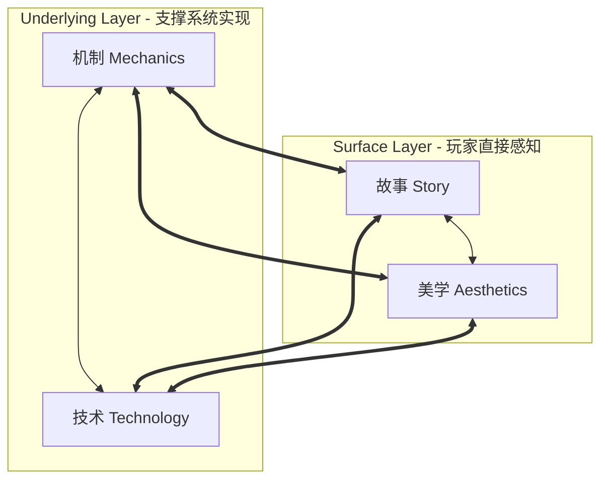
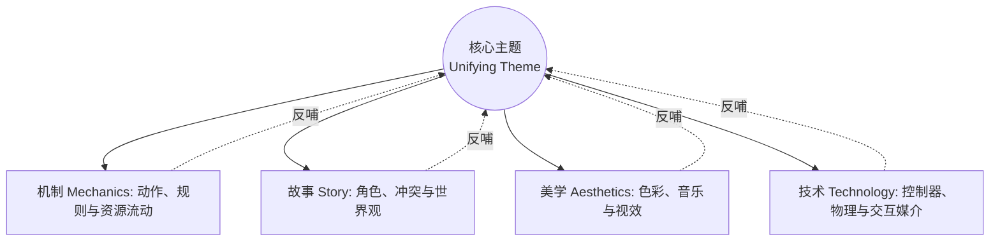

# 元素四元组与统一主题指南 (Elemental Tetrad & Unifying Theme)

> “四元组不是一个选择清单，而是一张无形的网。拉动其中任何一根线，整张网都会随之颤动。”  
> —— Jesse Schell，《游戏设计的艺术》

---

## 1. 元素四元组模型 (The Elemental Tetrad)

游戏设计的核心基石是四大本质元素的和谐统一。没有哪一个元素天生比其他元素更重要；忽视任何一个元素都会导致整个游戏系统的崩塌。

### 1.1 四大元素详解

| 元素 | 本质定义 | 涵盖范畴 | 关键自查问题 |
| :--- | :--- | :--- | :--- |
| **技术 (Technology)** | 承载游戏的物理与工程媒介 | 硬件平台、图形渲染管线、物理引擎、网络同步机制、输入控制器、存储与内存预算 | 我们的技术是否能够平滑支撑核心机制与美学表现？有无过度工程或技术瓶颈？ |
| **机制 (Mechanics)** | 游戏运行的规则与逻辑系统 | 空间、时间、对象与属性、动作（操作动词）、规则、状态机、胜负结算条件 | 核心机制在剥离视觉与故事后是否依然有趣？规则之间是否存在逻辑冲突或死锁？ |
| **故事 (Story)** | 游戏随着时间展开的事件序列 | 线性剧情、分支叙事、涌现叙事（Emergent Story）、角色动机与弧光、世界观设定 | 故事是强行塞入的背景板，还是从玩家的机制交互中自然生长出来的？ |
| **美学 (Aesthetics)** | 塑造玩家感官体验的声画表现 | 视觉风格、色彩基调、音频设计（BGM/SFX/环境音）、触觉反馈、界面排版质感 | 美学风格是在烘托核心体验的情绪，还是在干扰玩家对机制信息的读取？ |

---

## 2. 元素间两两协同法则 (Tetrad Intersections)

1. **机制 $\leftrightarrow$ 技术 (Mechanics & Technology)**:
   - 技术决定机制的物理边界与响应速度（例如：《任天堂明星大乱斗》对 60fps 极低输入延迟的严苛要求；《Portal》基于物理渲染与无缝传送门空间拓扑的技术支撑）。
   - **设计禁忌**：构想了宏大的物理破坏机制，却选择了无法进行高效刚体解算的引擎。
2. **机制 $\leftrightarrow$ 美学 (Mechanics & Aesthetics)**:
   - 美学为机制提供直观的**示能性 (Affordance)**。红色代表危险/可爆炸、发光代表可交互、重型武器带有沉重的挥舞后摇音效与屏幕震颤。
   - **设计禁忌**：美学视觉过于华丽，导致玩家无法看清弹幕攻击判定点或有效落脚点。
3. **机制 $\leftrightarrow$ 故事 (Mechanics & Story)**:
   - 追求**玩法叙事协同 (Ludonarrative Harmony)**。玩家在机制层面的核心动作应当与其在故事中的角色身份动机高度一致（例如：《Brothers: A Tale of Two Sons》用左右摇杆分别控制两兄弟，最终通过操作形式表达失去与成长的叙事高潮）。
   - **设计禁忌**：主角在剧情中是个和平主义圣人，在机制中却需要无差别屠戮敌人（Ludonarrative Dissonance）。
4. **故事 $\leftrightarrow$ 美学 (Story & Aesthetics)**:
   - 美学是故事世界观的具象化。色彩饱和度的递减暗示世界的衰败，音乐配器的变化烘托剧情阶段的转变。
5. **故事 $\leftrightarrow$ 技术 (Story & Technology)**:
   - 决定叙事呈现的形式。是采用预渲染 CGI、实时光线追踪过场、还是基于行为树的动态环境叙事。
6. **美学 $\leftrightarrow$ 技术 (Aesthetics & Technology)**:
   - 艺术家与技术工程师的握手。着色器（Shaders）、粒子系统与性能优化的完美平衡。

---

## 3. 统一主题与全息设计 (Unifying Theme & Holographic Design)

### 3.1 什么是统一主题 (Unifying Theme)？
- 主题是游戏想要传达的**核心思想或中心体验**（例如：“孤独”、“生命的脆弱与坚韧”、“贪婪导致毁灭”、“连接孤立的心灵”）。
- 主题不是剧情大纲，而是一根贯穿始终的“红线”。

### 3.2 全息设计法则 (The Holographic Design Principle)
- **全息图特性**：如果你把一张全息照片切成碎片，每一块碎片无论多小，都能投射出完整的全貌。
- **全息游戏设计**：游戏的每一个局部细节（UI 字体、背包整理音效、死亡惩罚、背景环境贴图）都应当映照出整体的核心主题。

### 3.3 全息设计四步自查法
1. **主题提炼**：用 1~2 句话写下你的游戏核心主题。
2. **要素映射**：将四元组的每一个子模块列出，注明其如何体现该主题。
3. **剔除杂质 (Pruning)**：找出所有“虽然酷炫但与主题毫不相干甚至相悖”的功能和美术资产，坚决砍掉。
4. **共鸣强化 (Amplification)**：思考如何让一个已有的机制在声效或视觉上更进一步贴近主题。

---

## 4. 倾听四种声音的艺术 (The Art of Listening)

Jesse Schell 强调，优秀的游戏设计师本质上是一个“超级倾听者 (Master Listener)”。设计陷入僵局往往是因为关闭了某一种声音的倾听通道：

1. **倾听团队 (Listening to the Team)**:
   - 尊重程序员的架构痛点与美术师的灵感火花。最好的创意往往来自于跨学科的即兴碰撞。
2. **倾听受众 (Listening to the Audience)**:
   - 观察玩家的“身体语言”而非仅仅听他们说了什么。玩家说“太难了”可能实际上意味着“引导不清晰”或“惩罚太挫败”。
3. **倾听游戏本身 (Listening to the Game)**:
   - 当原型跑起来后，游戏会产生自己的生命力和意外趣味（涌现性）。不要执着于最初的策划文档，顺应游戏展现出的真实乐趣方向进行调整。
4. **倾听内心 (Listening to Self)**:
   - 保持真诚的审美直觉。如果你自己都觉得某个机制枯燥乏味，绝不可能通过堆砌华丽包装来打动玩家。

---

## 5. 实战透镜速查 (Key Lenses for Tetrad & Theme)

- **【#1 基础体验透镜 (Lens of Essential Experience)】**：我希望玩家获得何种本质体验？游戏的所有元素是否都在催化这种体验？
- **【#7 基础四元组透镜 (Lens of the Elemental Tetrad)】**：我的设计是否兼顾了机制、故事、美学与技术？它们是否在相互支撑？
- **【#8 统一主题透镜 (Lens of the Unifying Theme)】**：我的游戏的核心主题是什么？每个独立决策是否都在为强化这个主题服务？
- **【#9 全息设计透镜 (Lens of Holographic Design)】**：如果把游戏的任意一个微小细节抽离出来，它是否依然蕴含着整体游戏的气质与灵魂？
- **【#10 倾听透镜 (Lens of Listening)】**：在当前的争论中，我是否真正倾听了玩家、团队、游戏本身和自我的声音？
