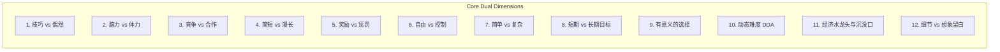
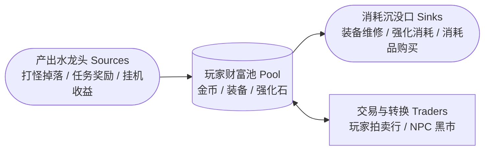
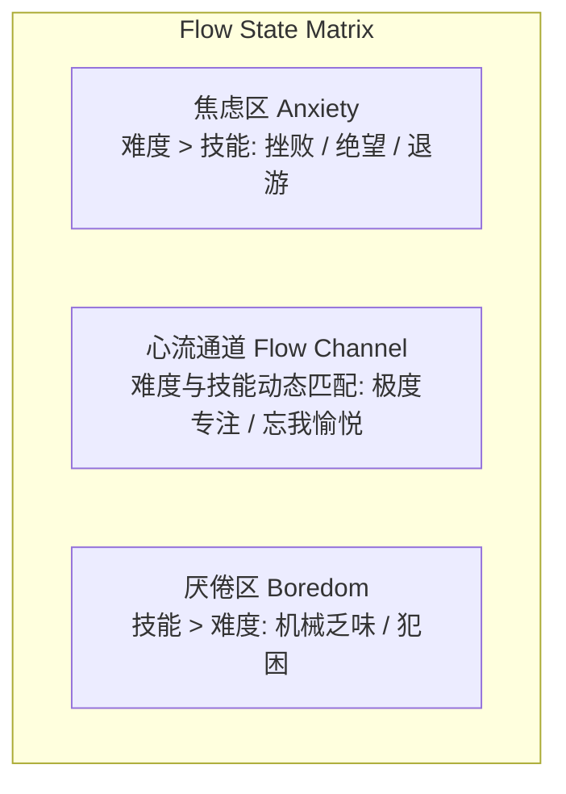

# 12 维游戏平衡与心流精调指南 (12 Dimensions of Balance & Flow)

> “平衡不是让所有东西都一模一样，而是让每一种选择都充满生命力，让玩家在挑战与能力的刀刃上优雅舞蹈。”  
> —— Jesse Schell，《游戏设计的艺术》

---

## 1. 游戏平衡的 12 大维度 (The 12 Dimensions of Balance)

Jesse Schell 指出，平衡游戏本质上是调和 12 组核心张力。失衡往往是因为某一边被极度夸大或过度压抑。

---

### 维度 1：技巧 vs 偶然 (Skill vs. Chance)
- **纯技巧游戏**（如国际象棋）：高度严肃、胜负绝对可预测、容易给新手带来巨大碾压挫败感。
- **纯偶然游戏**（如轮盘赌）：人人机会均等、刺激但缺乏深度成就感。
- **黄金调和策略**：
  - **输入随机 (Input Randomness)**：先掷骰子/抽牌（随机事件），由玩家运用技巧决定如何应对（策略博弈，如《杀戮尖塔》）。
  - **输出随机 (Output Randomness)**：先做决定再掷骰子命中率（高风险，需严格控制方差，避免努力付诸东流）。

---

### 维度 2：脑力 vs 体力/手速 (Head vs. Hands)
- **脑力要素**：记忆、逻辑推理、空间想象、策略规划、心理博弈。
- **体力/手速要素**：手眼协调、毫秒级极限反应、连续精准搓招、体力耐力。
- **平衡原则**：
  - 明确游戏的核心受众画像。避免在深度策略下棋游戏中突然插入极其苛刻的 QTE 反射判定，引起体验撕裂。

---

### 维度 3：竞争 vs 合作 (Competition vs. Cooperation)
- **竞争的乐趣**：证明优越感、博弈对抗、戏剧性逆风翻盘。
- **合作的乐趣**：陪伴认同、分工互补、共同战胜强敌的连结感。
- **复合模式**：
  - **组队竞争 (Team vs. Team)**：内部极致合作 + 外部激烈对抗（如 MOBA/战术射击）。
  - **半合作 (Semi-Cooperative)**：共同达成目标，但个人积分暗中竞争（如《桌游卡坦岛》）。

---

### 维度 4：简短 vs 漫长 (Short vs. Long)
- **单局时长 (Session Length)**：手游碎片化（3~5 分钟） vs 主机沉浸式长篇单局（30~60 分钟）。
- **节奏控制**：
  - 单局过短则无法展开复杂策略弧线；单局过长则失败成本过高导致玩家疲劳。
  - **解决之道**：在长流程中嵌入高密度的阶段性结算点（Checkpoints / Safe Rooms）。

---

### 维度 5：奖励 vs 惩罚 (Rewards vs. Punishments)
- **奖励的 7 种类型**：
  1. 赞美与视听反馈 (Praise & Juice)
  2. 点数与代币 (Points & Currency)
  3. 玩法能力扩展 (Power-ups / New Skills)
  4. 奇观与新内容解锁 (Spectacle & Unlocks)
  5. 表达与虚荣装扮 (Customization)
  6. 减压与安全区 (Safe Haven)
  7. 戏剧高潮 (Narrative Climax)
- **惩罚铁律**：
  - 惩罚必须具有**教育意义**（让玩家明白为何失败）。
  - 杜绝剥夺玩家“不可逆的时间”。例如：死亡后让玩家重复走 15 分钟毫无危险的空旷死路是对生命的谋杀。

---

### 维度 6：自由 vs 受控体验 (Freedom vs. Controlled Experience)
- **绝对自由**：沙盒沙盘，容易让玩家失去目标、陷入“我接下来该干嘛”的迷茫。
- **绝对受控**：线性过山车，缺乏自主性，沦为按键播片工具人。
- **优雅解法**：**“有边界的游乐场”**。设立明确的宏观目标，但在达成路径、战术流派和空间探索上赋予极高自由度。

---

### 维度 7：简单 vs 复杂 (Simple vs. Complex)
- **内在复杂性 (Innate Complexity)**：规则条目臃肿、说明书几十页（劣质复杂）。
- **涌现复杂性 (Emergent Complexity)**：底层规则极其优雅简洁（如围棋黑白两子），但在互动中自发涌现出浩瀚无穷的深度（优质复杂）。
- **法则**：永远追求 **“易于上手，难于精通 (Easy to Learn, Hard to Master)”**。

---

### 维度 8：短期目标 vs 长期目标 (Short-term vs. Long-term Goals)
- **目标套娃法则 (Nested Goals)**：
  - 瞬时目标（秒级）：躲避迎面飞来的火球。
  - 短期目标（分钟级）：清理这个房间的敌人开门。
  - 中期目标（小时级）：收集材料锻造一把屠龙宝剑。
  - 长期目标（终局级）：推翻暴君统治、拯救整个王国。
- 玩家在任何一秒都应同时处于多层嵌套目标的驱动之下。

---

### 维度 9：有意义的选择与支配策略消除 (Meaningful Choices)
- **支配性策略 (Dominant Strategy)**：如果存在一种无脑操作永远胜过其他所有选项，游戏就失去了选择意义。
- **破除支配策略的 4 大剪刀**：
  1. **情境克制 (Contextual Utility)**：没有万能武器，火属性克制草系，水属性克制火系。
  2. **非对称代价 (Trade-offs)**：高伤害必定伴随高前摇/高冷却/低防御。
  3. **信息不完全 (Fog of War / Bluffing)**：让玩家必须根据对手的虚实动态调整策略。
  4. **动态环境改变 (Dynamic Arena)**：地形变化与突发天气迫使固有套路失效。

---

### 维度 10：动态难度调整 (DDA: Dynamic Difficulty Adjustment)
- 游戏在后台悄悄监测玩家的挫败指数与连胜状态。
- **精调手法**：
  - 当玩家濒死时提高其隐性防御，或降低敌人的攻击欲望；
  - 绝不能让玩家察觉到 DDA 的存在，否则会彻底摧毁玩家战胜强敌的自豪感（“原来不是我厉害，是系统在同情我”）。

---

### 维度 11：经济系统的水龙头与沉没口 (Sources & Sinks)

- **三大失衡绝症**：
  1. **通货膨胀**：水龙头远远大于沉没口，金币泛滥沦为废纸，经济崩溃。
  2. **经济死锁 (Deadlock)**：产出被切断，玩家没有资源修理装备导致无法打怪，彻底卡死。
  3. **贫富分化与断层**：老玩家资源溢出，新玩家毫无立足之地。

---

### 维度 12：细节展示 vs 想象留白 (Detail vs. Imagination)
- 不需要把每一个 NPC 的祖宗十八代都写在对话框里；
- 精准呈现关键的 10% 细节，剩下的 90% 交由玩家的大脑去自动补全与神化。

---

## 2. 心流通道调校 (Flow Channel Tuning)

基于 Mihaly Csikszentmihalyi 的心流理论，Jesse Schell 提出了针对游戏的心流控制模型：

### 2.1 心流构建的 4 大必备条件
1. **清晰的目标 (Clear Goals)**：玩家时刻清楚知道下一步该做什么。
2. **即时无歧义的反馈 (Immediate Feedback)**：每一个动作在 0.1 秒内得到声画确认。
3. **心智全神贯注 (Focused Attention)**：排除外界杂音与繁琐的无关操作。
4. **掌控感的幻觉 (Paradox of Control)**：感觉胜负由自己完全主宰，即便局势万分凶险。

### 2.2 锯齿形心流张力曲线 (Sawtooth Pacing Curve)
- 难度不能平直上升，而应呈现**“阶梯爬升 - 爆发决战 - 坠入安全呼吸区 - 再爬升”**的锯齿节拍。让玩家在击败 Boss 后有时间享受战利品、整理背包、品味成就感。
