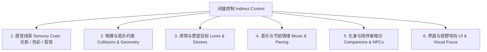

# 间接控制艺术与玩家心理学指南 (Indirect Control & Player Psychology)

> “最完美的设计不是拿枪逼着玩家走哪条路，而是让玩家发自内心地认为‘这是我自己的英明决定’，同时这恰好正是你希望他走的方向。”  
> —— Jesse Schell，《游戏设计的艺术》

---

## 1. 间接控制的 6 大法门 (The 6 Methods of Indirect Control)

在游戏世界中，粗暴的强制空气墙与死板的文字提示会瞬间打破玩家的主动能动性 (Agency)。顶级设计师善用“间接控制 (Indirect Control)”引导玩家。



### 1.1 感觉线索 (Sensory Cues)
- **视觉聚光灯**：人眼本能地被高对比度、光源和暖色调吸引。将关键通道打上微弱的暖光或点燃火把，阴暗角落自然被视为非主要路径。
- **声音指引**：水滴声、怪物的低吼、远处传来的八音盒旋律，利用 3D 空间音频诱导玩家侧头探索。

### 1.2 物理与拓扑约束 (Constraints & Geometry)
- **视线遮挡与登顶渴望**：利用山坡或弯道遮挡目标全貌，利用露出的塔尖勾引玩家翻山越岭。
- **天然漏斗地形 (Funneling)**：通过两旁茂密的树木、残垣断壁自然将散开的玩家收拢至同一战术交火点。

### 1.3 诱饵与愿望目标 (Lures & Desires)
- **面包屑效应 (Breadcrumbs)**：在地面上稀疏散落的收集品（金币、弹药箱、发光蘑菇），形成一条诱人的“引导抛物线”。
- **未达成的视线挑逗**：隔着铁栅栏让玩家提前看到一把金光闪闪的宝剑，植入“我一定要找到绕过去的钥匙”的坚定动力。

### 1.4 音乐与节拍情绪 (Music & Pacing)
- 音乐从舒缓的木吉他突然无缝切入紧促的定音鼓和弦乐，玩家在没有看到任何文字警告的情况下，身体会自动进入防御警戒姿态。

### 1.5 化身与陪伴者暗示 (Companions & NPCs)
- 陪伴 NPC（如《最后生还者》的艾莉或《战神》的阿特柔斯）不经意间向前快走两步、在某处石壁前驻足张望，玩家会自然跟进并调查该区域。

### 1.6 界面与视野导向 (UI & Visual Hierarchy)
- 通过动态虚焦、景深变化和边缘暗角，将玩家的全部注意力牢牢锚定在屏幕中心的核心威胁上。

---

## 2. 界面分类学 (The 4 Types of UI)

Jesse Schell 将游戏界面的交互形式划分为四大经典范式：

```mermaid
graph LR
    subgraph 存在于游戏故事世界内 (Diegetic in World)
        D[叙事内界面 Diegetic<br>如《死亡空间》脊柱血条]
        S[空间界面 Spatial<br>如《全境封锁》投射在地面的全息路线]
    end
    subgraph 仅存在于玩家屏幕表面 (Non-diegetic on Screen)
        ND[非叙事外挂界面 Non-diegetic<br>如传统的固定屏幕 HUD 血条]
        M[元界面 Meta<br>如屏幕上的血迹飞溅 / 视线水珠]
    end
```

| 界面类型 | 故事世界存在？ | 空间几何融入？ | 典型案例 | 优缺点与设计考量 |
| :--- | :---: | :---: | :--- | :--- |
| **叙事内界面 (Diegetic)** | **是** | **是** | 《死亡空间》背部血条、《辐射》哔哔小子 | **沉浸感极致**。但对视觉角度和布局要求高，信息展示量受限。 |
| **空间界面 (Spatial)** | **否** | **是** | 《全境封锁》投射地面的导航箭头、敌人头顶的 3D 血条 | **直观清晰**，与 3D 空间无缝绑定，不遮挡屏幕中心视线。 |
| **元界面 (Meta)** | **是** | **否** | 濒死时的屏幕四周红血模糊、潜水时的护目镜水汽 | 极具生理临场感，直接传达角色当前身体异常状态。 |
| **非叙事外挂界面 (Non-diegetic)**| **否** | **否** | 传统 MMO 屏幕顶部的方形头像与快捷栏 | **功能性最强**、信息读取最精准，但容易割裂沉浸感。 |

---

## 3. 玩家心理学与心智模型 (Mental Models & Psychology)

### 3.1 心智模型 (The Mental Model)
- **客观世界 vs 心理表征**：玩家在屏幕上看到的不是代码，而是在大脑中构建起的一座**“运转中的概念沙盘”**。
- **认知摩擦 (Cognitive Friction)**：当游戏表现与玩家日常生活常识发生严重违背（如：一扇看起来脆弱的木门无论用火箭筒怎么轰都毫发无损），玩家的心智模型会崩溃，引发强烈的出戏与挫败。

### 3.2 投射效应 (The Projection Phenomenon)
- **化身 (Avatar) 心理学**：
  - **空白容器型 (Blank Slate)**：主角沉默寡言、面容隐蔽（如林克、士官长），便于玩家把自己的性格、喜怒哀乐 100% 投射进去。
  - **预设人格型 (Defined Character)**：主角拥有强烈的个性、过往与口音（如杰洛特、亚瑟·摩根），玩家以“导演/密友”的视角产生共情。

### 3.3 自决理论三大心理需求 (Self-Determination Theory in Games)
1. **胜任感 (Competence)**：渴望战胜困难、精进技艺、感受到自身能力的持续膨胀。
2. **自主权 (Autonomy)**：渴望拥有选择权，按照自己的意志探索和解决问题，拒绝被当成傀儡。
3. **归属感 (Relatedness)**：渴望被他人看见、认可，与游戏中的 NPC 或真实队友建立深刻的情感羁绊。

### 3.4 越轨的快感 (The Joy of Safe Transgression)
- 游戏是现实法则的“安全避风港”。玩家在游戏中渴望尝试现实中被禁止、有危险或道德不允许的行为（如偷窃、超速漂移、无所顾忌地破坏）。
- **设计启发**：为玩家提供能够“合法使坏”的机制发泄口，但将其限定在不伤害真实他人的魔圈之内。
