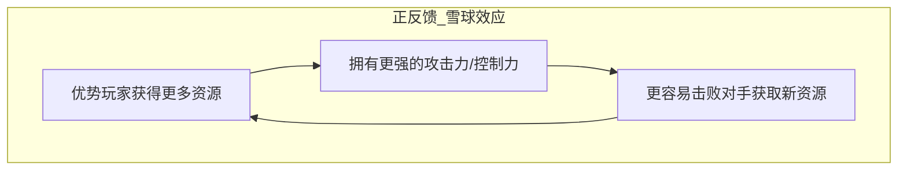
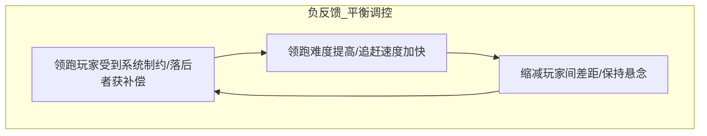

# 游戏形式元素深度指南 (Formal Elements Deep Dive)

《游戏设计梦工厂》（Game Design Workshop）将「形式元素（Formal Elements）」定义为构成游戏基本结构的核心构件。它们是让游戏成为游戏的规则系统，剥离了美术、音效与故事后的骨架。

---

## 1. 玩家 (Players)

玩家是游戏系统的自主参与者。设计时必须明确界定玩家的组织结构与互动模式。

### 1.1 玩家数量与模式 (Player Interaction Patterns)
- **单人 vs 游戏系统 (Single Player vs. Game System)**: 核心在于玩家与谜题、环境或 AI 的对抗与博弈（如《俄罗斯方块》、《空洞骑士》）。
- **多玩家竞争模式 (Player vs. Player / PvP)**: 零和博弈或相对优势争夺，关注公平性、信息对称度与技巧博弈（如《国际象棋》、《街头霸王》）。
- **多玩家合作模式 (Cooperative Play)**: 玩家共享目标、协同分工以对抗系统（如《双人成行》、《胡闹厨房》）。
- **单人 vs 多人模式 (One-on-Many)**: 非对称对抗，一人扮演 Boss 或特殊角色对抗其余玩家（如《黎明杀机》）。
- **团队竞争模式 (Team vs. Team)**: 队内协作 + 队际对抗（如 MOBA、战术射击）。
- **各自为战的多人竞争 (Multilateral / Free-for-All)**: 3人及以上无结盟对抗，容易产生动态外交、制衡与“打手”效应（如《大富翁》、《卡坦岛》）。
- **边界合作/竞争混合 (Coopetition / Semicooperative)**: 既有共同目标防灭团，又有个人积分胜负（如《死亡寒冬》）。

### 1.2 玩家角色 (Player Roles)
- 玩家在游戏中的身份定义、能力边界、责任分工。
- 非对称角色设计（Asymmetric Roles）：不同角色拥有完全不同的规则集与目标集。

---

## 2. 目标 (Objectives)

目标为玩家赋予行动意义与驱动力，通常与玩家体验目标（Player Experience Goals）紧密挂钩。

### 常见的 10 类经典核心目标：
1. **捕获/消除 (Capture / Eliminate)**: 摧毁或占领敌方资产（如国际象棋吃子、射击游戏淘汰）。
2. **追逐/逃避 (Chase / Evade)**: 空间上的捕获与逃脱，依赖速度、敏捷与预判（如《吃豆人》、捉迷藏）。
3. **竞速 (Race)**: 谁最先到达终点或最先完成特定目标（如赛车、竞速闯关）。
4. **对齐/空间布局 (Alignment / Spatial Arrangement)**: 将元素按照特定几何或逻辑关系排列（如《三消》、《五子棋》）。
5. **救援/护送 (Rescue / Escape)**: 将目标单元或自身从危险环境中转移到安全区。
6. **禁区/防守 (Forbidden Act / Territory Defense)**: 阻止对方进入某区域或禁止触发某种惩罚行为（如塔防、不要踩白块）。
7. **建设/扩张 (Construction / Expansion)**: 建造、积累、升级资源与领地（如《模拟城市》、《星际争霸》基建）。
8. **探索 (Exploration)**: 揭开未知区域、寻找隐藏要素（如开放世界、银河恶魔城）。
9. **解谜 (Puzzle-Solving)**: 寻找隐藏的逻辑规律或唯一的解法路径。
10. **收集与组合 (Collection / Set-Collection)**: 收集特定组合的物品或卡牌（如《宝可梦》全图鉴、麻将胡牌）。

---

## 3. 规程与规则 (Procedures & Rules)

### 3.1 规程 (Procedures)
规程是游戏过程中玩家采取动作的具体步骤与流程序列：
- **起始规程 (Starting Actions)**: 初始状态设置、资源分发、先后手决定。
- **进程式规程 (Progression of Play)**: 回合制步骤（准备阶段、行动阶段、结算阶段）或即时制状态循环（输入->计算->响应）。
- **特殊规程 (Special Actions)**: 满足特定条件时触发的非标准动作（如升级、技能冷却完成、特殊事件）。
- **终局规程 (Resolving Actions)**: 判定游戏结束、胜负结算与奖励分配的流程。

### 3.2 规则 (Rules)
规则是定义游戏世界的绝对法则，包含：
- **定义对象的概念规则**（什么是棋子、什么是障碍物）。
- **限制玩家行为的限制性规则**（不能越过某边界、移动步数上限）。
- **触发因果的逻辑规则**（如果生命值归零，则判定死亡）。
- **例外规则**（特例优于通则，常用于卡牌效果）。

---

## 4. 资源 (Resources)

资源是玩家在游戏中管理、消耗、转化以达成目标的要素。

### 4.1 核心资源类型
- **生命值/容错率 (Lives / Health)**: 决定生存状态。
- **单位/资产 (Units / Assets)**: 棋子、士兵、建筑、角色卡。
- **货币与代币 (Currency & Tokens)**: 用于交换与交易。
- **行动力/精力 (Actions / Energy / Mana)**: 限制单回合/单位时间内的操作频次与强度。
- **时间 (Time)**: 倒计时、行动耗时、冷却周期。
- **空间与领地 (Space & Territory)**: 控制的地图格数、安全区大小。
- **信息 (Information)**: 视野范围（战争迷雾）、对手手牌、谜题线索。
- **特殊能力/道具 (Power-ups / Special Abilities)**: 消耗型或永久性强化。

### 4.2 资源动力学 (Resource Dynamics)
- **获取途径 (Sources)**: 玩家如何产生或拾取资源？
- **消耗途径 (Sinks)**: 资源在何处被消耗或流失？
- **转换机制 (Converters)**: 资源 A 如何转化为资源 B（如金币买装备、时间换等级）？
- **稀缺性与通胀控制 (Scarcity & Inflation)**: 资源过剩导致决策贬值，资源过缺导致挫败与卡关。

---

## 5. 冲突 (Conflict)

冲突产生张力（Tension），阻止玩家过快或过于轻松地达成目标。

### 5.1 冲突来源
- **障碍 (Obstacles)**: 物理空间或逻辑阻碍（如地形、墙壁、锁闭的门）。
- **对手 (Opponents)**: 具有对抗意图的其他玩家或敌方 AI。
- **困境与权衡 (Dilemmas / Trade-offs)**: 不可兼得的选择（如风险 vs 收益、短期收益 vs 长期投资、进攻 vs 防守）。

---

## 6. 边界 (Boundaries)

边界界定了游戏的物理与心理空间——即赫伊津哈（Johan Huizinga）所谓的**“魔圈（Magic Circle）”**。
- **物理边界**: 棋盘边缘、地图空气墙、屏幕分辨率。
- **社会与心理边界**: 现实世界与游戏规则的隔离协议（如在游戏中互相攻击并不等于现实生活中的敌对）。
- **时效边界**: 游戏开始与结束的时间跨度。

---

## 7. 结果 (Outcomes)

结果是游戏终局的状态界定：
- **零和博弈 (Zero-sum)**: 赢家的收益等于输家的损失（必有一胜一负）。
- **非零和博弈 (Non-zero-sum)**: 所有人可能共赢（合作通关）或全员失败，或各自获得不同程度的成就评级（如三星评价、天梯段位）。
- **可逆性 vs 不可逆性**: 阶段性失败是否能够挽回。

---

## 8. 系统动力学与反馈回路 (Feedback Loops)

形式元素相互作用构成了动态系统，系统中最关键的动态调节机制是反馈回路。

### 8.1 正反馈 (Positive Feedback Loop)
- **特点**: 强化变化，造成“滚雪球（Snowball）”效应。
- **作用**: 快速推动游戏走向终局，给予优势方强烈的爽感与主导感。
- **风险**: 导致落后玩家过早陷入“绝望期（Hopelessness）”，失去翻盘希望而放弃。

### 8.2 负反馈 (Negative Feedback Loop)
- **特点**: 抑制偏差，自我平衡（如马里奥赛车中的落后者蓝龟壳、吃豆人中幽灵根据距离降速）。
- **作用**: 保持比赛悬念，延长有效心流体验，防止单方面碾压。
- **风险**: 挫败领先者的成就感（如果落后补偿过强，会导致“故意落后策略”）。
