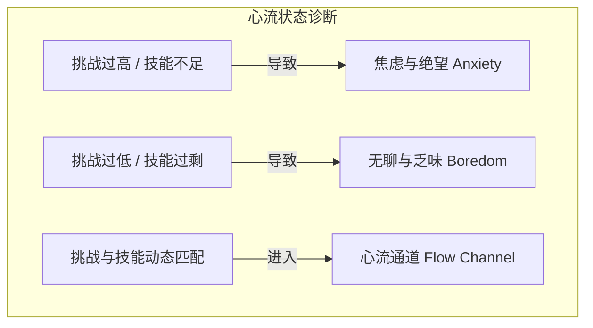

# 玩家测试与体验评估方法论 (Playtesting & Metrics Guide)

《游戏设计梦工厂》（Game Design Workshop）将**玩家测试（Playtesting）**视为整个以玩为中心设计哲学的基石。测试不是为了证明你的设计是对的，而是为了**暴露盲点、验证假设、发现未被预料的乐趣与痛点**。

---

## 1. 测试的五个进阶阶段 (Stages of Playtesting)

| 阶段 | 测试对象 | 核心目标 | 关键行动 |
| :--- | :--- | :--- | :--- |
| **1. 自我测试 (Self-Testing)** | 设计师自己 | 验证规则基本运转、排查致命死锁与数字溢出 | 反复推演极端情况（如所有人都选防守、抽不到关键卡） |
| **2. 密友测试 (Confidant Testing)** | 亲近的设计师、同事、朋友 | 获得安全、快速的初步概念反馈 | 讨论核心机制的吸引力与理解难度 |
| **3. 小组测试 (Group Playtesting)** | 目标玩家群体的小样本 (3-5人) | 观察核心玩法循环、心流体验与微观平衡 | 记录玩家行为反应与情绪波动 |
| **4. 盲测 (Blind Playtesting)** | 完全不认识的陌生玩家（无任何外部讲解） | 检验规则书、教学关卡与 UI 的自解释能力 | 设计师全程闭嘴，仅通过文字/界面让玩家自行摸索 |
| **5. 焦点小组与大规模测试 (Focus Groups & Broad Testing)** | 目标市场用户大样本 | 收集受众画像偏好、长期留存欲望与商业化反馈 | 结合问卷、访谈与后台遥测数据（Telemetry） |

---

## 2. 玩家测试现场的三大铁律 (Golden Rules)

1. **绝对不要在测试中教玩家玩游戏 (Do NOT Teach or Defend)**:
   - 当玩家困惑、按错键或走错路时，**忍住不要提示**！这正是你的引导或界面设计存在严重问题的最真实证据。
   - 绝不要为自己的设计做辩护（“其实这个设定是因为后面有某某情节……”），玩家的感受永远是事实。
2. **观察行为远胜于听取意见 (Actions Speak Louder Than Words)**:
   - 玩家经常会“嘴上说很好玩，身体却不停打哈欠/看手机”；或者“嘴上抱怨难度太高，手里却死死抓着手柄重试了20次”。
   - 重点记录：玩家在哪里停顿？在哪里皱眉？何时发笑？何时出现挫败叹气？
3. **倾听问题，但不要盲信玩家提出的解决方案 (Listen to the Problem, not the Solution)**:
   - 玩家是感受痛点的专家，但绝大多数玩家不是系统工程专家。如果玩家说“把这个 Boss 的血量砍掉一半”，核心问题可能是“Boss 招式前摇太隐蔽导致反应不及”，而非纯数值问题。

---

## 3. 测试后访谈与提问技巧 (Debriefing Techniques)

### 3.1 避免引导性提问 (Avoid Leading Questions)
- ❌ **错误提问**: “你觉得刚才拿到的那把火焰剑是不是很酷？”（强行引导好评）
- ✅ **正确提问**: “刚才探索过程中，哪件装备给你的印象最深？为什么？”
- ❌ **错误提问**: “第三关是不是有点太难了？”
- ✅ **正确提问**: “在整个通关过程中，你觉得最吃力或最顺畅的节点分别在哪里？”

### 3.2 深度挖掘三步提问法
1. **现象定位**: “刚才在第 2 回合，我注意到你犹豫了很久才出牌，当时你在考虑什么？”
2. **动机剖析**: “在当时的情况下，你最想做的事情是什么？有什么阻碍了你？”
3. **情绪确认**: “那一刻你感受到的是挑战带来的兴奋，还是不知所措的困惑？”

---

## 4. 体验量化与心流诊断 (Flow & Usability Metrics)

### 关键诊断指标对照表：
- **学习摩擦力 (Learning Friction)**: 玩家从接触游戏到独立完成首个完整循环所需的平均用时与提问次数。
- **支配性策略 (Dominant Strategy)**: 是否存在某种无脑套路，使得其他所有策略都失去意义？如果出现，说明系统平衡性崩溃。
- **死局/垃圾时间 (Deadlocks & Downtime)**: 玩家在游戏中无事可做或已知必输却无法快速结束的时间占比。
- **高光时刻频率 (Peak Experience Frequency)**: 玩家在单局游戏中触发惊喜、大招翻盘、惊险逃脱等高强度情绪波动的次数。
