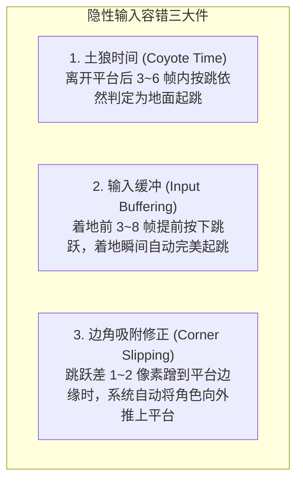
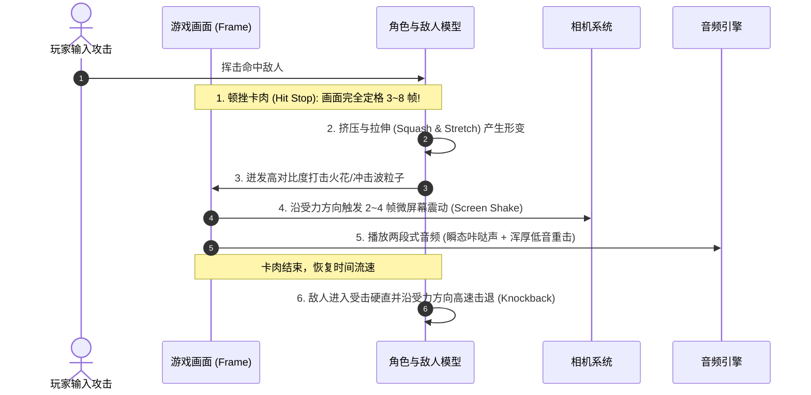

# 操作手感调校与微反馈系统 (Game Feel, Juice & Input Ergonomics)

> “手感好（Good Game Feel）不是一个抽象概念，而是一组极其精确的物理参数、隐性输入容错机制与毫秒级视听反馈的集合。” —— Steve Swink《Game Feel》
>
> “打击感的本质，就是让玩家确信自己的操作在游戏世界中产生了极其剧烈的真实物理后果。” —— 樱井政博

本指南系统拆解任天堂在角色控制物理、输入容错技术（“对玩家善意的谎言”）与打击感/交互多感官反馈（Juice）方面的量化调校法则。

---

## 1. 经典马力欧动力学物理模型 (Mario Kinematics)

任天堂自《超级马力欧兄弟》(1985) 到《超级马力欧 奥德赛》(2017) 始终坚持的操作动力学模型：

```text
高度 (Y)
  ^
  |        .---.  (最高点有极短微滞空感)
  |       /     \
  |      /       \  (下落重力加速度 > 上升重力，下落极快且干脆)
  |     /         \
  |    /           \
  |   /             '
  +--+---------------+-----> 时间 (t)
   [短按A: 小跳]     [长按A: 大跳]
```

### 1.1 核心参数配方
1. **可变按键跳跃（Variable Jump Height）**：
   - 绝不使用固定的跳跃高度！
   - 当玩家轻点跳跃键（Tap，如 1~3 帧）时，角色立即以较低初速度起跳或提前切断上升力，完成灵活的“小跳”；
   - 当玩家持续按住跳跃键（Hold）时，持续施加向上推力直到达到最大跳跃高度。
2. **非对称重力（Asymmetric Gravity）**：
   - **上升重力系数 $g_{up}$ 较小**：给予玩家充足的空中瞄准与方向微调时间。
   - **下落重力系数 $g_{down} \approx 1.5 \sim 2.0 \times g_{up}$**：下落迅猛干脆，杜绝“像在月球上漂浮”的迟钝感。
3. **惯性、摩擦力与急刹转头（Inertia & Skid）**：
   - 奔跑起步需要 0.1~0.2 秒的加速度渐进；
   - 全速奔跑中反向拨动摇杆，角色会触发特殊的“急刹脚滑动画（Skid）”伴随灰尘粒子和刺耳音效，赋予角色真实的物理质量感。

---

## 2. 隐性容错技术：对玩家“善意的谎言” (Forgiving Input Mechanics)

任天堂游戏之所以“手感平滑、极少误操”，是因为系统在底层暗中帮玩家修正了大量微小失误，使玩家坚信自己是个操作高手。



### 2.1 参数量化规范表
| 容错机制 | 作用原理 | 推荐容差范围 | 解决的玩家痛点 |
| :--- | :--- | :--- | :--- |
| **土狼时间 (Coyote Time)** | 角色脚底离开平台边缘悬空后，仍在极短时间内允许起跳。 | **$60 \sim 100 \text{ ms}$**<br>(约 4 ~ 6 帧 @60fps) | 避免玩家在视觉上明明觉得自己按了跳，但因为走快了半步直接垂直摔死。 |
| **预输入缓冲 (Input Buffer)** | 在角色尚未完成当前动作（如尚在空中未着地、尚在硬直中）时，提前记录下一个按键指令。 | **$80 \sim 150 \text{ ms}$**<br>(约 5 ~ 9 帧 @60fps) | 避免玩家连招或落地连续起跳时，因为按早了 1 帧导致指令吞掉。 |
| **判定盒双标（Hitbox Bias）** | • 玩家的受击框（Hurtbox）比角色视觉模型略小 10%~20%；<br>• 敌人的受击框比视觉模型略大 10%~20%。 | 边缘缩进 $2 \sim 4 \text{ px}$ | 制造“千钧一发险险躲过”的刺激感，避免“明明没碰到怎么死了”的冤枉感。 |
| **边缘滑入（Corner Slip）** | 角色头部在跳跃上升时若蹭到天花板或平台角落的一角，自动水平平移修正。 | $2 \sim 6 \text{ px}$ 侧向位移 | 避免被平台微小直角卡住垂直坠落。 |

---

## 3. 樱井政博“打击感与反馈”六要素 (Juice & Feedback Anatomy)

无论是在《任天堂明星大乱斗》还是《星之卡比》中，一次令人大呼过瘾的攻击都必须精准编排以下 6 个多感官毫秒级事件：



### 3.1 打击感关键参数
1. **命中顿挫/卡肉（Hit Stop / Freeze Frames）**：
   - 普通轻攻击：定格 **2 ~ 4 帧**；
   - 强力重击 / 终结技：定格 **6 ~ 12 帧**；
   - 效果：赋予攻击“切入骨肉”的阻力感与爆发力。
2. **两段式击中音效（Layered Audio）**：
   - **高频层（Transient Snap）**：清脆的金属撞击或皮肉拍打声（传达精准度）。
   - **低频层（Low-end Thud）**：浑厚深沉的重低音（传达破坏力与重量）。
3. **定向屏幕震动（Directional Screen Shake）**：
   - 震动方向应当与攻击力的矢量方向平行（如向下重砸则垂直震动，横扫则水平震动），并在 3 帧内呈对数衰减归零。
