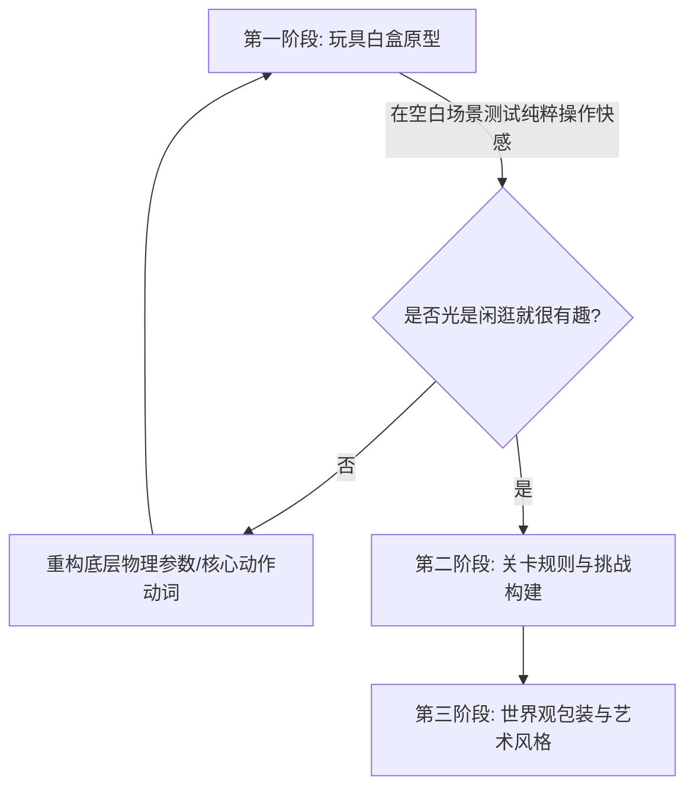

# 任天堂游戏创意哲学与发散方法论 (Ideation & Design Philosophy)

> “一个好的创意，不是解决一个问题的方案，而是**一个能同时解决多个独立问题的单一方案**。” —— 宫本茂
>
> “枯萎技术的水平思考，就是利用已经成熟、廉价且被充分验证的技术，换一个角度思考，开发出全新的玩法。” —— 横井军平

本指南系统拆解任天堂自 1980 年代至今经久不衰的核心设计哲学与创意发散方法，指导开发者在立项与机制设计初期确立极高趣味浓度与极低开发浪费的方案。

---

## 1. 枯竭技术的水平思考 (Lateral Thinking with Withered Technology)

由 Game Boy 与 Game & Watch 之父**横井军平**提出，是任天堂软硬件创新的第一基石。

```mermaid
graph LR
    subgraph 传统高精尖路线 (垂直思考)
        A1[昂贵前沿新技术] --> A2[高门槛/高成本] --> A3[堆砌算力与画质]
    end
    subgraph 任天堂路线 (水平思考)
        B1[成熟廉价枯竭技术] --> B2[横向跨界组合] --> B3[创造全新交互体验与玩具感]
    end
```

### 1.1 核心原则
- **“枯竭/成熟”技术的优势**：
  - 成本极低、良品率高、供应链稳定；
  - 特性与局限性已被完全探明，开发者无需花精力调试底层黑盒，可专注于“玩法本身”；
  - 对算力要求低，运行极其流畅稳定。
- **“水平思考”的实现路径**：
  - **跨界借用**：把计算器液晶屏做成掌机（Game & Watch），把廉价三轴陀螺仪做成体感手柄（Wii），把成熟红外摄像头做成纸箱互动工具（Nintendo Labo）。
  - **以限制为特色**：硬件性能不足时，不强行做写实模拟，而是采用高对比度、风格化卡通美术（如《塞尔达传说：风之杖》的卡通渲染），使画面在 20 年后依然不过时。

### 1.2 实战思考清单
当你在构思新项目或新机制时，自问：
1. 我们是否过度依赖昂贵、复杂的最新技术或大算力模型来制造噱头？
2. 现有最成熟、开发成本最低的基础机制（如跳跃、射线检测、抓取、碰撞），是否能通过改变规则上下文（如重力反转、时间暂停、视角锁定）诞生完全不同的体验？

---

## 2. 宫本茂“复合解题法则” (Miyamoto's Multi-Solution Rule)

在游戏设计中，糟糕的加法往往是：“遇到问题 A 加一个系统 1，遇到问题 B 再加一个系统 2”。任天堂的优秀设计永远是寻找**单一机制同时化解多个维度的痛点**。

### 2.1 经典案例拆解
| 机制案例 | 解决的问题 1 (核心玩法) | 解决的问题 2 (资源/引导) | 解决的问题 3 (社交/体验) |
| :--- | :--- | :--- | :--- |
| **《超级马力欧》问号块与蘑菇** | 给予玩家收集奖励与变大能力 | 蘑菇向右滑落逼迫玩家向前奔跑（引导前进） | 变大充当“生命缓冲”，被碰一下变小代替直接死亡（降低挫败感） |
| **《斯普拉遁/Splatoon》墨汁系统** | 地图占领与胜负判定核心 | 潜入墨汁可高速移动与瞬间装填弹药（机动与续航） | 潜入墨汁隐藏身形避免被射击（隐蔽与防守） |
| **《超级马力欧 奥德赛》帽子投掷** | 远程攻击与击打互动道具 | 作为空中跳跃借力跳板延长滞空距离 | 附身敌对生物（直接复用海量敌人行为作为新玩法） |
| **《塞尔达传说：王国之泪》究极手** | 解决地形跨越与解谜难题 | 消耗世界中冗余掉落素材创造载具（循环消耗） | 激发玩家在社交媒体自发传播搞笑/脑洞建造（病毒式破圈） |

### 2.2 复合解题设计步骤
1. **罗列当前设计的 2~3 个核心痛点**（如：关卡太长玩家疲劳 + 缺少战斗资源 + 移动缺乏操作感）。
2. **寻找一个能够连通这三者的物理/动词动作**（例如：“滑铲动作”：滑铲加速赶路 + 滑铲撞碎障碍获得能量 + 滑铲过程获得无敌帧避开攻击）。
3. **验证闭环**：该动作是否自然易懂，不需要多余 UI 提示？

---

## 3. 玩具感先行 (Toy-First / Mechanics-First)

任天堂认为：**“如果一个游戏光是在一个毫无贴图的白盒场景里移动和跳跃不好玩，那么加上世界上最精彩的剧情和美术，它依然不是个好游戏。”**



### 3.1 “玩具”与“游戏”的区别
- **玩具 (Toy)**：没有既定胜负目标，仅凭操作与物理反馈就能带来直接愉悦（如把玩弹簧、摆弄遥控车）。
- **游戏 (Game)**：具有规则、限制与胜负目标。
- **任天堂铁律**：核心交互（移动、跳跃、抓取、投掷、射击）必须**首先是一件好玩的玩具**，然后才在上面施加规则成为游戏。

---

## 4. 乘法法则 (The Rule of Multiplication)

出自《塞尔达传说：旷野之息》GDC 2017 开发者演讲。

### 4.1 加法设计 vs 乘法设计
- **加法设计 (Add-on Design)**：
  - “做一把火把用来点火” + “做一把斧头用来砍树” + “做一个炸弹用来炸石头”。
  - 成本：$N$ 个道具对应 $N$ 种特定交互，一旦离开特定场景道具即失效。
- **乘法设计 (Multiplication Design)**：
  - 构建通用的**物理引擎（运动与碰撞）**与**化学引擎（元素状态转化）**。
  - 规则：
    - 火接触木材 $\rightarrow$ 燃烧产生热气流；
    - 风遇到热气流 $\rightarrow$ 产生上升气流；
    - 滑翔伞遇到上升气流 $\rightarrow$ 玩家升空；
    - 任何可燃物（草地、木盾、敌人木棒）接触火都会燃烧。
  - 结果：少数几条系统规则产生指数级连锁反应，允许玩家利用直觉创造出开发者从未预设的通关方案。

---

## 5. “制造微笑”与直觉亲和力 (Nintendo's Player Empathy)

岩田聪提出游戏必须面向从 5 岁到 95 岁的所有人：

1. **认知零门槛**：现实生活常识即游戏常识（如“红色是危险/火焰”、“冰面会打滑”、“重物会沉水”、“圆的东西可以滚”）。
2. **正向反馈密集**：每次成功的微操作（哪怕只是踩扁一个板栗仔、拾取一枚金币）都伴随明快音效与视觉弹跳。
3. **把挫败转化为好奇**：玩家死亡时，镜头清晰展示死因（如被什么撞到、从哪跌落），让玩家心里升起“原来是这样，我再试一次一定能过”而非摔手柄。
