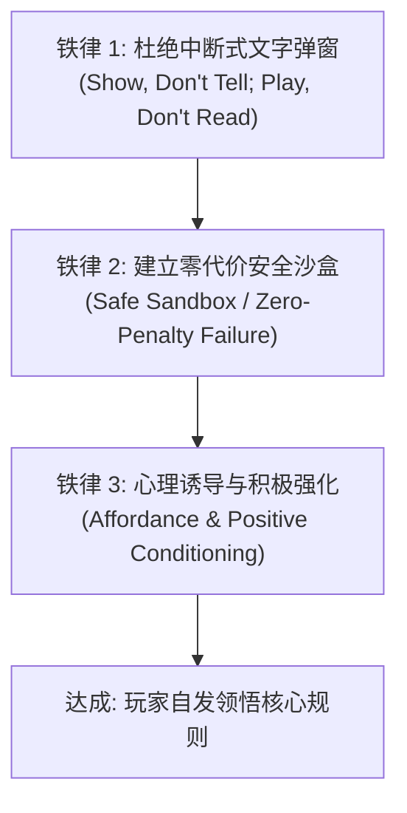
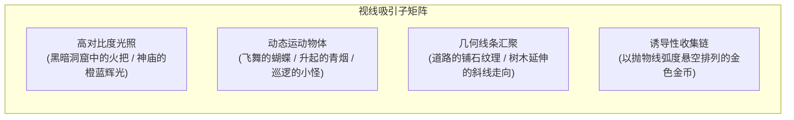

# 隐性教学与直觉化引导设计 (Invisible Tutorials & Intuitive Guidance)

> “教学的最高境界，是让玩家觉得自己极其聪明，是在凭自己的直觉发现了游戏的规则，而不是被开发者按着头灌输知识。” —— 宫本茂

本指南系统拆解任天堂**“去文字化”、“去强弹窗”**的隐性关卡引导技术（Invisible Tutorials），以及如何利用环境几何、色彩对比与安全沙盒构建无师自通的直觉化体验。

---

## 1. 隐性教学三大铁律 (Three Golden Rules of Invisible Guidance)



1. **绝对不要在玩家沉浸操作时强行暂停弹出一整页文字说明书**。玩家在玩游戏时大脑处于“动作反应模式”，强行切换到“阅读理解模式”会产生严重的挫败感。
2. **首次试错必须在“绝对安全的死胡同”中发生**。如果玩家第一次接触新机制就因为不知道规则而坠入悬崖死亡，这种负反馈是恶性的；如果在封闭坑洞中跳跃并无意间顶出蘑菇，这种正反馈是永恒的。
3. **利用现实生活直觉与认知可供性（Affordance）**：
   - 尖刺、火焰、红色 $\rightarrow$ 本能回避（危险）；
   - 闪烁、金色、圆形、问号 $\rightarrow$ 本能触碰（奖励）；
   - 缝隙、裂纹、不自然的微光 $\rightarrow$ 本能攻击或探索（隐藏物）。

---

## 2. 封神之作：1985《超级马力欧兄弟》1-1 关卡开场逐格拆解

宫本茂在《超级马力欧兄弟》World 1-1 前 10 秒的设计，被誉为游戏史上最伟大的隐性教学案例：

```text
[场景开局]
+-------------------------------------------------------------------------+
|                                                                         |
|                                     [?] [砖] [?] [砖] [?]              |
|                                                                         |
|     (马力欧)               (板栗仔)                      [绿色水管]     |
|      (向右)                (向左走)                                     |
|  =====================================================================  |
|  [安全区: 无后退路]       [危机来临]                   [高度跳跃检验]   |
+-------------------------------------------------------------------------+
```

### 2.1 精密的设计推导链条
1. **确立行进方向**：
   - 马力欧开局位于屏幕偏左侧，右侧留有大片开阔空白。左侧是坚硬的屏幕边缘无法后退。人类的心理本能促使玩家向右侧开阔空间前进。
2. **第一次危机与跳跃教学**：
   - 屏幕右侧迎面走来第一只敌人（板栗仔）。它眼神凶狠、迎面走来。
   - 此时玩家只有两个选择：站着不动（被撞死并重开）或按下 A 键起跳（踩死板栗仔或跳过它）。
   - 无论哪种，玩家在 3 秒内立刻掌握了“A 键是跳跃”和“敌人会造成伤害”两条核心规则。
3. **问号块与头顶碰撞**：
   - 接着玩家看到悬在空中的金色问号块。其高度恰好是马力欧普通跳跃能够顶到的位置。
   - 玩家出于好奇跳起顶撞，金币伴随清脆的“叮！”声跳出并计入分数。这瞬间建立了“用头顶块会有好东西”的条件反射。
4. **变大蘑菇的心理陷阱与顿悟**：
   - 随后玩家顶出了一只红色蘑菇。蘑菇落地后由于物理碰撞向右滑行，撞到前方的水管后反弹向马力欧滑来。
   - 玩家受惊以为是新型敌人，尝试起跳躲避，但由于上方砖块遮挡，往往会不小心撞到蘑菇。
   - 撞到蘑菇的瞬间，不仅没有死亡，反而伴随华丽的升调音乐，马力欧身形变大一倍！
   - **心理峰值**：玩家原本的恐惧瞬间转化为惊喜，“红色蘑菇是超级强化道具！”的概念牢牢印入脑海。
5. **水管高度与跳跃力度进阶**：
   - 前方出现 1 格高、2 格高、3 格高的连续水管，自然逼迫玩家学会“短按小跳”与“长按大跳”的力度控制。

---

## 3. 现代任天堂视线引导技术 (Visual Guiding & Attractors)

在 3D 空间中，没有了 2D 滚屏的强制约束，任天堂采用以下视觉吸引子（Attractors）引导玩家视线：



### 3.1 诱导性金币弧线（Coin Arcs）
- 在跳跃悬崖前，摆放一条呈完美抛物线排列的微光金币。
- 金币的作用不仅是得分奖励，更是**无声的物理轨迹示意图**。它在无形中告诉玩家：“只要你以当前奔跑速度从边缘起跳并长按跳跃键，你的飞行轨迹就会完美穿过这串金币安全着陆。”

---

## 4. 去文字化隐性教学诊断排查清单

当你在审查自己的游戏或关卡教学时，对照以下清单逐项排查：

- [ ] **是否出现了暂停游戏的文字说明弹窗？** 能否将其替换为场景中的交互动作？
- [ ] **玩家学习新技能的环境是否绝对安全？** 如果玩家在学会新动作前按错键，是否会遭受不可逆的严厉惩罚？
- [ ] **道具和机关的外观是否符合直觉（Affordance）？** 看到弹簧就知道能踩，看到把手就知道能拉，看到发光裂纹就知道能炸。
- [ ] **相机镜头是否自然聚焦在关键目标上？** 走出封闭空间时，镜头是否拉高自然展示广阔远景？
- [ ] **失败时的死因是否一目了然？** 玩家能否在 0.5 秒内看清自己是因为踩空、被火烧还是被刺扎死？
