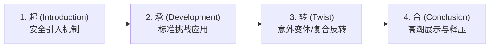
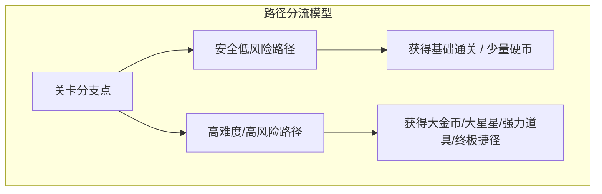

# “起承转合”关卡设计法与风险回报体系 (Kishōtenketsu & Level Architecture)

> “起承转合原本是东方四段式诗歌和叙事的结构。我们发现把它应用在 3D 马力欧的关卡中，能让关卡在完全不依赖文字教学的前提下，自然呈现出起伏与高潮。” —— 林田宏一 (GDC 2012 / 2014)

本指南系统拆解任天堂在平台跳跃、动作冒险及解谜关卡设计中最核心的**“四步起承转合”（Kishōtenketsu）模型**，以及樱井政博的**“风险与回报”（Risk & Reward）**平衡法则。

---

## 1. “起承转合”四步关卡模型 (The 4-Step Level Design)



### 1.1 四阶段实战标准

| 阶段 | 关卡意图 | 环境设计与安全度 | 典型体验与玩家心理 |
| :--- | :--- | :--- | :--- |
| **起 (Introduction)** | **安全引入**：让玩家在没有任何死亡危险或惩罚的环境下，首次遭遇并理解新机制。 | • 地面封闭、无即死陷阱、无强威胁敌人。<br>• 机制特征被放大（如闪烁的机关、明显的按键提示物）。 | “咦？踩这个红板子会翻转？很有意思，我多踩两次试试看。” |
| **承 (Development)** | **熟练应用**：在标准游戏场景下检验玩家对该机制的掌握程度。 | • 引入悬崖、尖刺或移动敌人。<br>• 失败会有扣血或掉落回下层的轻度惩罚，但节奏稳定可控。 | “我现在得在敌人走过来之前踩翻转板跳过去，没问题，我已经会了！” |
| **转 (Twist)** | **意料之外的反转**：改变机制的前提条件，或与另一个旧机制复合，带来思维冲击。 | • 引入节奏变化（如时间限制、翻转板自动高速切换、追击波）。<br>• 或者反转规则（如重力翻转、黑暗环境、反向移动）。 | “天哪！这次翻转板居然会随着背景音乐节拍自己翻！我必须算好节拍起跳！” |
| **合 (Conclusion)** | **高潮释压与成就结算**：给玩家一个充分发挥已掌握技能的舞台，随后迎来奖励与关底。 | • 最后的综合大跳跃/机关连携。<br>• 成功后直达终点旗杆/宝箱，获得大量金币与视听赞美。 | “太帅了！我完美连跳通关了！这关真过瘾！” |

---

## 2. 经典案例逐帧拆解：《超级马力欧 3D世界》“翻转跳板”关卡

- **【起】**：玩家站在一块平稳的大陆上，正前方是两块红蓝翻转板（踩下 A 键起跳时红蓝交替翻转）。下方是坚实的实木地板，掉下去不会死。玩家通过原地乱跳，自然发现“每次跳跃，脚下的板子都会切换颜色”。
- **【承】**：前方出现深渊，红蓝翻转板悬空在深渊之上。玩家需要计算跳跃节奏，在空中让接应板由隐藏变为实体，安全跳至对岸。
- **【转】**：关卡中段，翻转板不再等待玩家跳跃触发，而是变成了“受关卡节拍脉冲（Beat）驱动自动以 120BPM 节拍翻转”！并且场景中加入了向玩家发射火球的敌人，玩家必须在规避火球的同时卡准背景音乐的重音起跳。
- **【合】**：终点前，一道由长达 6 块高速节奏翻转板组成的上升阶梯，顶部直通金色最高旗杆。玩家一口气行云流水连续起跳，摘得最高分，关卡在欢快的通关音乐中圆满收尾。

---

## 3. 樱井政博“风险与回报”系统 (Risk and Reward)

任天堂顶级动作与对战设计（如《任天堂明星大乱斗》《星之卡比》）的核心支柱是：**永远让玩家自己决定承受多大的风险，并给予与之成绝对正比的回报。**



### 3.1 风险回报设计的黄金准则
1. **显性可见的代价**：玩家在做出决策前，必须能清晰预判“如果我失败了会发生什么”（例如：那枚绿色大星星悬挂在无底深渊上方仅容一脚的窄平台上）。
2. **多层级目标分流（Self-balancing Difficulty）**：
   - **休闲玩家**：走平坦大道，只要通关即可。
   - **硬核玩家**：挑战悬崖边的收集物或限时高难分支。
   - 这使得游戏无需提供枯燥的“简单/普通/困难”菜单难度选择，游戏世界本身即是自适应难度。
3. **“贪婪诱饵”（Greed Bait）的摆放艺术**：
   - 将高价值收集物（如大金币、关键钥匙）放置在危险敌人的行动轨道正中间。
   - 当玩家出于贪婪尝试极限操作险胜时，产生的多巴胺浓度是普通通关的数倍。

---

## 4. 关卡宏观张力与心流曲线 (Macro Pacing Curve)

单个关卡通常由 **1 ~ 2 组完整的“起承转合”循环** 复合而成。整体心流应当呈现“波浪式上升，终点释压”的节奏：

```text
张力 (Tension)
  ^
  |              [转: 惊奇变体]          [合: 最终高潮]
  |                  / \                      /\
  |       [承: 熟练] /   \                   /  \   [通关结算]
  |          /\     /     \ [短暂停顿]      /    \____
  |  [起]   /  \___/       \___/           /
  |  ___---'                              /
  +----------------------------------------------------> 关卡流程 (Time)
```

### 4.1 防疲劳设计（Downtime & Breath）
- 在“转”的高潮与下一个挑战之间，必须设计 **2~5 秒的“呼吸区”（Breath Area）**。
- 呼吸区通常是一段没有敌人、只有少量微光硬币或安全风景的平缓通道，让玩家的大脑神经从紧绷中恢复，为下一个峰值蓄力。
