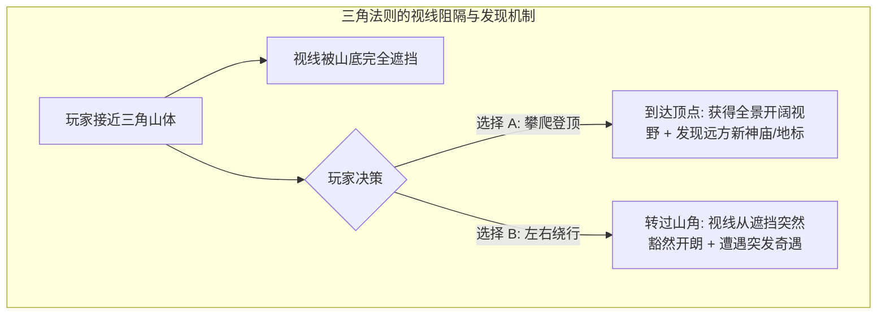
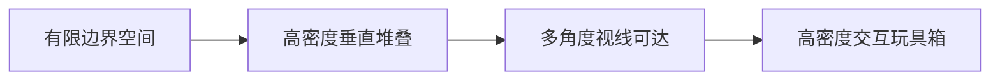

# 空间探索、三角法则与箱庭设计 (Space Exploration & World Crafting)

> “在《旷野之息》中，我们之所以大量使用三角形山丘，是因为三角形能同时起到‘视线遮挡’与‘给予选择’两种作用。” —— 藤林秀麿 (GDC 2017)

本指南系统拆解任天堂在 3D 开放世界探索（如《塞尔达传说：旷野之息/王国之泪》）与 3D 箱庭关卡（如《超级马力欧：奥德赛》）中的空间构建法则。

---

## 1. 三角法则 (The Triangle Rule)

三角法则是任天堂开放世界地理布局的核心几何语法。



### 1.1 三角法则的两大核心功用
1. **天然的视线遮蔽与惊喜揭示 (Occlusion & Reveal)**：
   - 如果地形一马平川，玩家一眼望穿所有内容，探索欲会立刻归零。
   - 三角形山体阻隔了后方景观。当玩家费尽力气爬到山顶或转过山脊时，被遮挡的壮丽景观或隐藏村落突然映入眼帘，产生强烈的**顿悟惊喜（Aha! Moment）**。
2. **直觉性的二选一诱导 (Implicit Choice)**：
   - 面对三角形结构，玩家本能会面临抉择：**“是花费体力攀爬登顶，还是沿着山脚绕行？”**
   - 两种选择分别对应不同的心流体验（攀爬获得宏观视野与滑翔机会；绕行则探索微观峡谷与敌人营地）。

---

## 2. 三级地标引力体系 (3-Tier Landmark Gravitational Hierarchy)

任天堂通过大、中、小三种尺度的地标在空间中布置“引力场”，彻底消灭“打开大地图看满屏问号图标”的枯燥感，实现**纯视线驱动的沉浸式探索**。

```text
+-------------------------------------------------------------------------+
|                                [大尺度地标: 终极方向引力]               |
|                                海拉鲁城堡 / 死亡火山 / 悬空神殿          |
|                                (几十公里外清晰可见，确立世界极点)       |
|                                                                         |
|            [中尺度地标: 阶段目标引力]        [中尺度地标]               |
|            发光的希卡之塔 / 破损神庙          高耸驿站 / 奇怪巨石山峰   |
|            (视线内 2~3 分钟路程，吸引玩家前往)                          |
|                                                                         |
|  [微尺度吸引子]        [微尺度吸引子]        [微尺度吸引子]             |
|  闪光的小树桩          三颗排成一排的苹果    一缕袅袅升起的篝火青烟      |
|  (10~30 秒遭遇，即时多巴胺奖励，克洛格果实 / 宝箱 / 巡逻小怪)          |
+-------------------------------------------------------------------------+
```

### 2.1 十秒/三十秒好奇心循环 (The 10-30 Second Curiosity Loop)
1. **视线捕捉**：玩家在前往中尺度地标的途中，视线余光在 10~30 秒内必定会捕捉到一个**微尺度异常点**（一块颜色不同的岩石、一圈奇怪的荷叶）。
2. **轻微偏航与即时满足**：玩家跑过去解开谜题，获得 1 个克洛格果实或开启小宝箱。
3. **重新校准与新线索**：当玩家捡完宝箱抬头四顾时，由于视角和高度的改变，又会看到另一个新的中尺度或微尺度目标。探索链条由此永动机般自发运转。

---

## 3. 宫本茂“箱庭理论” (Hakoniwa / Miniaturized Garden Concept)

箱庭（Miniature Sandbox Garden）是源自日本传统盆景与微缩庭院的设计理念，是《超级马力欧64》《阳光马力欧》《超级马力欧 奥德赛》的灵魂。



### 3.1 箱庭世界的四大特征
1. **边界紧凑，密度极高**：不做空旷巨大的无意义旷野，而是把空间做成多层立体结构（地下洞穴、地面广场、空中楼阁、屋顶天台）。
2. **一地多用（Reusability of Space）**：同一个场景，在不同任务或不同能力下（如马力欧附身不同怪物后），能够被探索出完全不同的路线。
3. **“所见即所达”的视觉挑衅**：在进入场景的最初广场，抬头就能看到挂在悬崖顶端的“能量之月”或金币。玩家虽暂时够不着，但强烈的渴望被瞬间种下。
4. **无需杀敌的纯粹探索乐趣**：箱庭里到处充斥着可交互的微型物理部件（水面、滑索、弹簧、可踢碎的木箱、跳跃回音）。

---

## 4. 地牢与关卡拓扑学 (Dungeon Topology & Boss Keys)

源自《塞尔达传说》历代 2D/3D 地牢的经典空间拓扑设计。

```mermaid
graph TD
    Entrance[地牢入口 / 核心中枢大厅 (Hub)] --> WingA[分支 A: 解锁关键道具/机关]
    WingA -->|单向单向跳下或捷径滑梯| Shortcut1[快捷重返 Hub (无需走回头路)]
    Entrance --> WingB[分支 B: 使用新道具突破旧阻碍]
    WingB --> Shortcut2[快捷重返 Hub]
    Entrance --> BossRoom[最终 Boss 房 (需要大钥匙/两路中枢解密完成)]
```

### 4.1 地牢设计的铁律
1. **中枢辐射拓扑（Hub and Spoke）**：以中央大厅为核心，向四周延伸出 2~4 条分支路线，避免单调的“一条单行道走到黑”。
2. **单向捷径（One-way Shortcuts）**：
   - 绝不强迫玩家原路返回！当玩家打通一条深处的支线并拿到关键钥匙后，必须立刻提供一条“踢落梯子”、“踩下开关打开铁栅栏”或“直接滑落”的捷径，让玩家 3 秒内快速重返中央中枢。
3. **新能力的溯源解锁（Retroactive Unlock）**：
   - 在地牢前半段，玩家会遇到一个显眼但无法通过的障碍（如悬崖对面的勾爪锚点）。
   - 在击败中 Boss 拿到“勾爪”后，玩家立即意识到“我终于可以去解开门口那个宝箱了！”，产生强烈的顿悟与成就感。
